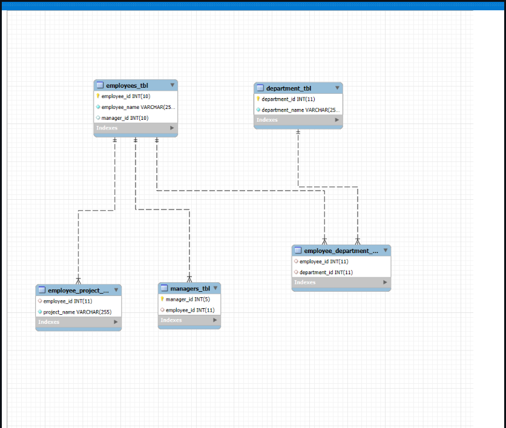

# Creating Table using MYSQL BASIC

### Steps in Task 1:

- Create a table named employees wtih the following fields.
- employee_id: Unique integer, auto increment, primary key.
- employee_name: String (VARCHAR) with up to 255 characters, not null
- manager_id: Integer, foreign key referencing employee_id in the same table(employee).
  

  ###  Steps in Task 2:
  
  - Create a table named departments wtih the following fields.
  - department_id: Unique integer, auto increment, primary key.
  - department_name: String (VARCHAR) with up to 255 characters, not null.
    
 

  ###  Steps in Task 3:
  
  - Create a table named employee_department wtih the following fields.
  - employee_id: Integer, foreign key referencing employee_id in employees.
  - department_id: Integer, foreign key referencing department_id in departments
  - Composite primary key (employee_id, department_id).
    
   

   ###  Steps in Task 4:
   
   - Create a table named employee_projects wtih the following fields.
   - employee_id: Integer, foreign key referencing employee_id in employees.
   - project_name: String (VARCHAR) with up to 255 characters, not null

  

  ###  Steps in Task 5:
  
  - Create a table named managers with the following fields.
  - manager_id: Unique integer, auto increment, primary key.
  - employee_id: Integer, foreign key referencing employee_id in employees.

   

### Copy of ER Diagram

